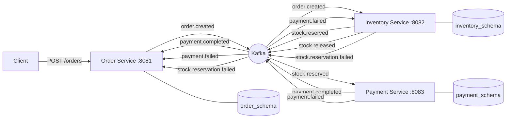
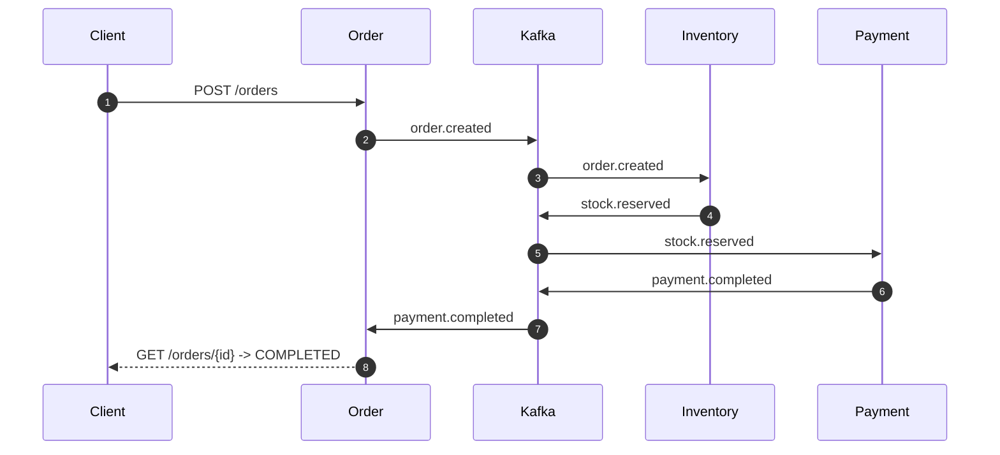
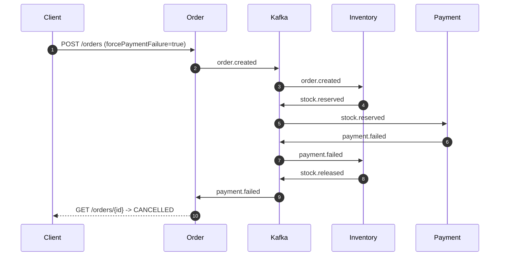

# Saga Demo

<p>
  <strong>Choreography-based distributed transactions with Spring Boot, Kafka, and PostgreSQL.</strong><br/>
  Three microservices complete one business transaction through events only.
</p>

<p>
  
  
  
  
  
</p>

## Contents
- [Why This Repo](#why-this-repo)
- [Architecture](#architecture)
- [Service Contracts](#service-contracts)
- [Repository Layout](#repository-layout)
- [Quick Start](#quick-start)
- [API](#api)
- [Scenario Matrix](#scenario-matrix)
- [Observability Runbook](#observability-runbook)
- [Reliability Model](#reliability-model)
- [Troubleshooting](#troubleshooting)
- [Stop and Reset](#stop-and-reset)

## Why This Repo
This project demonstrates a full choreography saga:

- `order-service` creates orders and tracks final status.
- `inventory` reserves/releases stock.
- `payment` accepts or declines payment.
- Kafka carries all inter-service communication.
- Each service owns its own schema inside Postgres (`order_schema`, `inventory_schema`, `payment_schema`).

There are no inter-service HTTP calls and no shared tables.

## Architecture


<details>
<summary><strong>Happy path sequence</strong></summary>


</details>

<details>
<summary><strong>Compensation path sequence (payment failure)</strong></summary>


</details>

## Service Contracts
| Service | Port | Owns Schema | Consumes | Publishes |
|---|---:|---|---|---|
| Order Service | 8081 | `order_schema` | `payment.completed`, `payment.failed`, `stock.reservation.failed` | `order.created` |
| Inventory Service | 8082 | `inventory_schema` | `order.created`, `payment.failed` | `stock.reserved`, `stock.reservation.failed`, `stock.released` |
| Payment Service | 8083 | `payment_schema` | `stock.reserved` | `payment.completed`, `payment.failed` |

### Kafka Topics
| Topic | Producer | Consumer(s) |
|---|---|---|
| `order.created` | Order | Inventory |
| `stock.reserved` | Inventory | Payment |
| `stock.reservation.failed` | Inventory | Order |
| `payment.completed` | Payment | Order |
| `payment.failed` | Payment | Order, Inventory |
| `stock.released` | Inventory | Optional observability consumers |

Dead-letter topics are also configured with `.DLT` suffix.

## Repository Layout
```text
saga-demo/
|- docker-compose.yml
|- init-db.sql
|- kafka-topics.sh
|- README.md
|- order-service/
|- inventory/
`- payment/
```

## Quick Start

### 0) One-time repo alignment check
This repository layout contains `inventory/` and `payment/`.

If your `docker-compose.yml` still references `./inventory-service` and `./payment-service`,
update the two build contexts first.

If inventory/payment image builds fail at `COPY --from=builder /app/target/...jar`, use a wildcard in each Dockerfile:

```dockerfile
COPY --from=builder /app/target/*.jar app.jar
```

### 1) Start infrastructure and services
```bash
docker compose up --build -d
docker compose ps
```

### 2) Create Kafka topics
```bash
bash ./kafka-topics.sh
```

### 3) Verify health
```bash
curl http://localhost:8081/actuator/health
curl http://localhost:8082/actuator/health
curl http://localhost:8083/actuator/health
```

Expected each response: `{"status":"UP"}`.

### 4) Create one order
```bash
curl -X POST http://localhost:8081/orders \
  -H "Content-Type: application/json" \
  -d '{
    "customerId": "cust-001",
    "productId": "prod-001",
    "quantity": 2,
    "amount": 1500.00,
    "forcePaymentFailure": false,
    "forceStockFailure": false
  }'
```

## API

### `POST /orders`
Creates an order and starts the saga.

Request body:
```json
{
  "customerId": "cust-001",
  "productId": "prod-001",
  "quantity": 2,
  "amount": 1500.00,
  "forcePaymentFailure": false,
  "forceStockFailure": false
}
```

Validation rules:
- `customerId`: required, non-empty
- `productId`: required, non-empty
- `quantity`: integer >= 1
- `amount`: decimal > 0

### `GET /orders/{id}`
Returns current order state:
- `PENDING`
- `COMPLETED`
- `CANCELLED`

## Scenario Matrix
Seed inventory data:

| Product | Quantity |
|---|---:|
| `prod-001` | 100 |
| `prod-002` | 5 |
| `prod-003` | 0 |

| Scenario | Request tweak | Expected order status | Notes |
|---|---|---|---|
| Happy path | Defaults | `COMPLETED` | Normal flow |
| Forced payment failure | `forcePaymentFailure=true` | `CANCELLED` | Triggers compensation (`stock.released`) |
| Gateway decline | `amount > 50000` | `CANCELLED` | Simulated payment gateway reject |
| Forced stock failure | `forceStockFailure=true` | `CANCELLED` | Payment service not invoked |
| Natural out-of-stock | `productId=prod-003` | `CANCELLED` | Stock check fails |
| Insufficient stock | `productId=prod-002`, `quantity > 5` | `CANCELLED` | Stock check fails |

## Observability Runbook

### Service logs
```bash
docker compose logs -f order-service
docker compose logs -f inventory-service
docker compose logs -f payment-service
```

### Topic stream watch
```bash
docker exec kafka kafka-console-consumer \
  --bootstrap-server localhost:9092 \
  --topic payment.failed \
  --from-beginning
```

### Database checks
```bash
docker exec -it postgres psql -U saga -d sagadb
```

```sql
SELECT id, status, created_at FROM order_schema.orders ORDER BY created_at DESC;
SELECT product_id, quantity, reserved, quantity - reserved AS available
FROM inventory_schema.inventory;
SELECT order_id, status, failure_reason, created_at
FROM payment_schema.payments ORDER BY created_at DESC;
SELECT topic, error_message, failed_at
FROM order_schema.dead_letter_events ORDER BY failed_at DESC;
```

## Reliability Model

### Retries and DLT
Each Kafka consumer uses `@RetryableTopic` with:
- 4 total attempts (1 initial + 3 retries)
- exponential backoff: 1s, 2s, 4s
- dead-letter routing to `*.DLT`

After retries are exhausted, each service persists the failed payload in its own `dead_letter_events` table.

### Idempotency
Each service stores processed event IDs in `processed_events` and skips duplicates.
This protects against redelivery after consumer restart/rebalance.

## Troubleshooting
- Build context error in compose:
  Verify service build contexts match actual directories (`order-service`, `inventory`, `payment`).
- JAR not found during Docker build:
  Use `COPY --from=builder /app/target/*.jar app.jar` in service Dockerfiles.
- Topic creation fails with "already exists":
  Safe to ignore, or make script idempotent with `--if-not-exists`.
- Services unhealthy after startup:
  Wait for Kafka/Postgres health checks and inspect `docker compose logs -f`.
- Port conflict:
  Free `8081`, `8082`, `8083`, `5432`, `9092`, `2181`.

## Stop and Reset
```bash
# Stop containers
docker compose down

# Full reset (delete volumes)
docker compose down -v
```

---

For deep dives, start with:
- `order-service/src/main/java/com/saga/order_service/service/OrderService.java`
- `inventory/src/main/java/com/saga/inventory/service/InventoryService.java`
- `payment/src/main/java/com/saga/payment/service/PaymentService.java`
